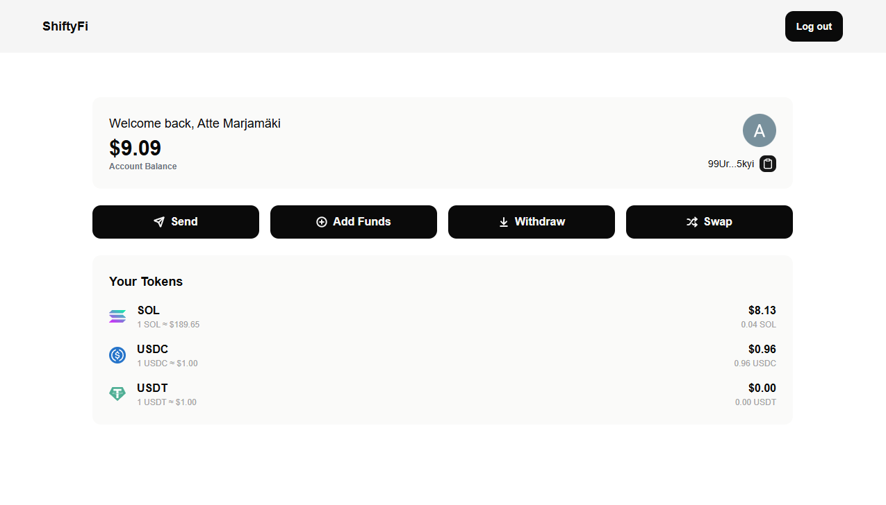
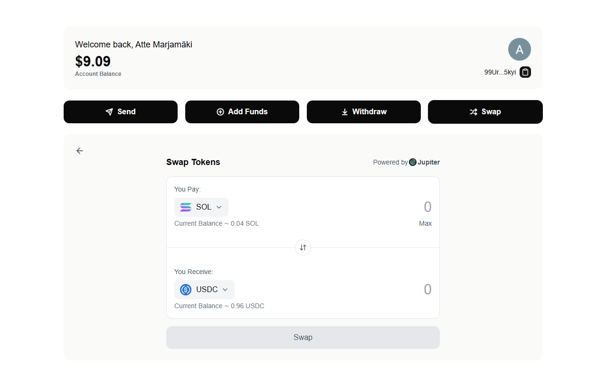

This is a [Next.js](https://nextjs.org) project bootstrapped with [`create-next-app`](https://nextjs.org/docs/app/api-reference/cli/create-next-app).

# CDEX - Centralized Decentralized Exchange

## 🚀 Overview

This is a simple **Centralized Decentralized Exchange** built with **Solana** integration. It provides a seamless experience for users to sign in with **Google**, receive a **Solana wallet**, and swap assets using **Jupiter's API**. While the platform controls the **private keys**, users can transparently verify **proof of reserves** on the blockchain.

## ✨ Features

- **Google Authentication** (via Auth.js)
- **Auto-Generated Solana Wallet** for each user
- **Token Swaps** (SOL, USD, USDC) via **Jupiter API**
- **Proof of Reserves** - Users can verify holdings on-chain
- **Minimalist UI & UX** with **TailwindCSS**

## 🛠 Tech Stack

- 
- 
- 
- 
- 
- 
- 

## Getting Started

This project is not deployed. To run it locally, you will need **Docker** to run the PostgreSQL database container.

First, run the development server:

```bash
npm run dev
# or
yarn dev
# or
pnpm dev
# or
bun dev
```

Open [http://localhost:3000](http://localhost:3000) with your browser to see the result.

You can start editing the page by modifying `app/page.tsx`. The page auto-updates as you edit the file.

This project uses [`next/font`](https://nextjs.org/docs/app/building-your-application/optimizing/fonts) to automatically optimize and load [Geist](https://vercel.com/font), a new font family for Vercel.

**Credit:** https://github.com/code100x/cdex




